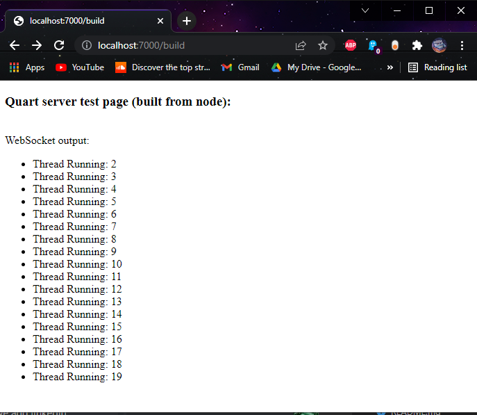

# Minimal [esbuild](https://esbuild.github.io/getting-started/#your-first-bundle), [Nodejs](https://developer.mozilla.org/en-US/docs/Learn/Server-side/Node_server_without_framework), and [Python Quart](https://pgjones.gitlab.io/quart/) concurrent test env.  

Requires: Python 3.7 or later and NodeJS LTS or later

This test runs a websocket and a thread on the [python](https://www.python.org/downloads/) quart server. You can access the Node-served test page at `http://localhost:8000` or the quart server test page at `http://localhost:7000` to experiment (add `/build` at port 7000 to access the node build (minus hot reload)). 

Quart enables fast asyncio server streams from python. Bonus thread-generated data in python streaming through websockets to show off the potential.

`npm run pip` should install any missing python packages. See [README](https://github.com/moothyknight/esbuild_base_python/blob/master/python/README.md))

`npm run dev` installs nodejs packages and runs both python and node servers concurrently (with hot reloading for FE with a persistent python streaming server backend).

After installing dependencies, 

## Run Python and Node together: 

`npm run concurrent`

## Otherwise

To run: `npm run build` to bundle, then `npm start` to run the node server.

* OR `npm test` to run both commands in sequence

You can specify https and add an ssl certificate if you follow the instructions.

>2 dependencies: `esbuild` and [`fragelement`](https://github.com/brainsatplay/domelement)

## Hot reloading (for dev)

`npm run dev`

then `npm run startdev` 

nodemon restarts the node server automatically when changes to included source files are detected.

The nodemon dev server adds basic frontend hot reloading via websocket and clientside code injection (see [nodeserver/server.js](https://github.com/moothyknight/esbuild_base/blob/master/node_server/server.js) for method).

> 2 dev dependencies: `nodemon` and `ws`

## PWA build:

To test:

`npm run pwa` 

This installs workbox-cli, generates the service worker, bundles and then starts the application. Run once if you don't need to modify the service-worker further.

> 1 additional dependency: `workbox-cli`

### Other notes:

See README.md files in each folder for more explanation on how to work with these types of applications.
